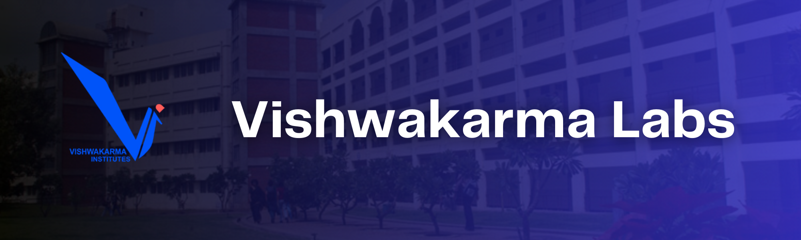

<a name="readme-top"></a>

[![Contributors][contributors-shield]][contributors-url]
[![Forks][forks-shield]][forks-url]
[![Stargazers][stars-shield]][stars-url]
[![Issues][issues-shield]][issues-url]
[![LinkedIn][linkedin-shield]][linkedin-url]

<!-- PROJECT LOGO -->
<br/>
<div align="center">
  <a href="https://github.com/siddhesh-desai/Vishwakarma-Labs-Terminal-Based">
    
  </a>
    <br>
    <br>

  <h3 align="center"><b>Vishwakarma Labs</b></h3>

  <p align="center">
    Vishwakarma Labs is an attendance management system designed for labs. With features like real-time chat, attendance tracking, and support for multiple participants, it makes managing lab sessions easy and efficient. The attendance is only marked if a student attends for a certain period of time.
    <br />
    <br>
    <a href="https://github.com/siddhesh-desai/Vishwakarma-Labs-Terminal-Based"><strong>Explore the docs »</strong></a>
    <br />
    <a href="https://github.com/siddhesh-desai/Vishwakarma-Labs-Terminal-Based">View Demo</a>
    ·
    <a href="https://github.com/siddhesh-desai/Vishwakarma-Labs-Terminal-Based/issues">Report Bug</a>
    ·
    <a href="https://github.com/siddhesh-desai/Vishwakarma-Labs-Terminal-Based/issues">Request Feature</a>
  </p>
</div>

<!-- ABOUT THE PROJECT -->
<br>

## ♾️ About The Project

Vishwakarma Labs is a software application designed to facilitate lab sessions for educational institutions. The application provides various features to help both the students and the lab instructor to have an interactive and productive lab session. The application allows multiple participants to join the server and participate in the lab session. Each participant is required to enter their name and roll number before joining the session. The server then stores this information along with the date and time the participant joined the session.

The attendance feature in the application ensures that the participants attend the session for a minimum duration before marking them present. The minimum duration is set by the lab instructor and can be changed based on the requirements of the lab session. The attendance is recorded in a CSV file that can be easily accessed and maintained by the lab instructor. The application also provides a chatroom feature where the participants can interact with each other and the lab instructor. This feature can be used to discuss any queries or doubts related to the lab session. The timer feature is also included in the application to ensure that the lab session is conducted within the allotted time. The timer is set by the lab instructor and can be modified based on the requirements of the lab session.

Overall, Vishwakarma Labs is a user-friendly and efficient software application that helps to conduct lab sessions in an organized and interactive manner.

<p align="right">(<a href="#readme-top">back to top</a>)</p>

## ⚙️ Built With

The technologies and tools used are:

- [![C Language][c]][c-url]
- [![Linux][linux]][linux-url]
- [![Socket][Socket]][Socket-url]

<p align="right">(<a href="#readme-top">back to top</a>)</p>

<!-- GETTING STARTED -->

## 🧑‍💻 Getting Started

Follow the below steps to set up the project locally:

### Prerequisites

The project needs to be set up on Linux, thus you need to have Linux Operating System.

### Installation

_Below is an example of how you can instruct your audience on installing and setting up your app. This project doesn't rely on any external dependencies or services._

1. Clone the repository

   ```sh
   git clone https://github.com/siddhesh-desai/Vishwakarma-Labs-Terminal-Based.git
   ```

2. Compile the Client and Server Side by running following commands:

   ```sh
   gcc client.c -o client
   ```

   ```sh
   gcc server.c -o server
   ```

3. Run the client and server side with the following commands in two different terminals:

   ```sh
   ./server
   ```

   ```sh
   ./client 127.0.0.1
   ```

<p align="right">(<a href="#readme-top">back to top</a>)</p>

<!-- USAGE EXAMPLES -->

## 💡 Features

<br>

- Timer Based Attendance
- Auto Updation of Attendance in CSV File
- Lab ChatRoom
- Updates to systems from Server

<p align="right">(<a href="#readme-top">back to top</a>)</p>

<!-- ROADMAP -->

## 🛣️ Roadmap

- [x] Timer Based Attendance
- [x] Updation in CSV File
- [x] Building of Chatroom
- [ ] Integration of Chatroom using Multithreading

See the [open issues](https://github.com/siddhesh-desai/Vishwakarma-Labs-Terminal-Based/issues) for a full list of proposed features (and known issues).

<p align="right">(<a href="#readme-top">back to top</a>)</p>

<!-- CONTRIBUTING -->

## 👣 Contributing

Any contributions you make are **greatly appreciated**.

If you have a suggestion that would make this better, please fork the repo and create a pull request. You can also simply open an issue with the tag "enhancement".
Don't forget to give the project a star! Thanks again!

1. Fork the Project
2. Create your Feature Branch (`git checkout -b feature/AmazingFeature`)
3. Commit your Changes (`git commit -m 'Add some AmazingFeature'`)
4. Push to the Branch (`git push origin feature/AmazingFeature`)
5. Open a Pull Request

<p align="right">(<a href="#readme-top">back to top</a>)</p>

<!-- CONTACT -->

## 📧 Contact

Siddhesh Desai - [@thesiddheshdesai](https://www.linkedin.com/in/thesiddheshdesai/) - siddheshdesai777@gmail.com

Project Link: [https://github.com/siddhesh-desai/Vishwakarma-Labs-Terminal-Based](https://github.com/siddhesh-desai/Vishwakarma-Labs-Terminal-Based)

<p align="right">(<a href="#readme-top">back to top</a>)</p>

## ✨ Contributors

Thanks go to these wonderful people:

- [Siddhesh Desai](https://github.com/siddhesh-desai/)

[contributors-shield]: https://img.shields.io/github/contributors/siddhesh-desai/Vishwakarma-Labs-Terminal-Based.svg?style=for-the-badge
[contributors-url]: https://github.com/siddhesh-desai/Vishwakarma-Labs-Terminal-Based/graphs/contributors
[forks-shield]: https://img.shields.io/github/forks/siddhesh-desai/Vishwakarma-Labs-Terminal-Based.svg?style=for-the-badge
[forks-url]: https://github.com/siddhesh-desai/Vishwakarma-Labs-Terminal-Based/network/members
[stars-shield]: https://img.shields.io/github/stars/siddhesh-desai/Vishwakarma-Labs-Terminal-Based.svg?style=for-the-badge
[stars-url]: https://github.com/siddhesh-desai/Vishwakarma-Labs-Terminal-Based/stargazers
[issues-shield]: https://img.shields.io/github/issues/siddhesh-desai/Vishwakarma-Labs-Terminal-Based.svg?style=for-the-badge
[issues-url]: https://github.com/siddhesh-desai/Vishwakarma-Labs-Terminal-Based/issues
[license-shield]: https://img.shields.io/github/license/siddhesh-desai/Vishwakarma-Labs-Terminal-Based.svg?style=for-the-badge
[license-url]: https://github.com/siddhesh-desai/Vishwakarma-Labs-Terminal-Based/blob/master/LICENSE.txt
[linkedin-shield]: https://img.shields.io/badge/-LinkedIn-black.svg?style=for-the-badge&logo=linkedin&colorB=555
[linkedin-url]: https://linkedin.com/in/thesiddheshdesai
[c]: https://img.shields.io/badge/C-000000?style=for-the-badge&logo=c&logoColor=white
[c-url]: https://devdocs.io/c/
[linux]: https://img.shields.io/badge/Linux-0769AD?style=for-the-badge&logo=Linux&logoColor=white
[linux-url]: https://linux.die.net/
[Socket]: https://img.shields.io/badge/Socket-20232A?style=for-the-badge&logo=Socket.io&logoColor=61DAFB
[Socket-url]: https://www.gnu.org/software/libc/manual/html_node/Sockets.html
